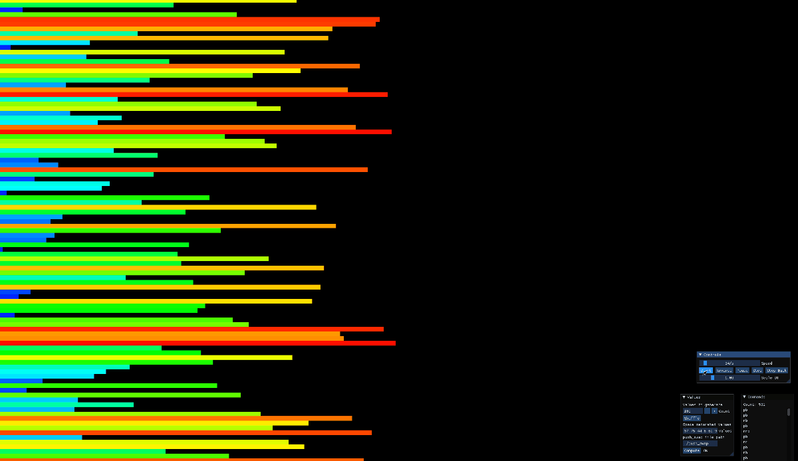

# Push-Swap

Push-Swap is a sorting algorithm project in the 42 School curriculum. The goal of this project is to sort a stack of integers with the help of another stack with the fewest possible operations. Available operations are predefined, 

## Table of Contents
- [Description](#description)
- [Installation](#installation)
- [Usage](#usage)
- [Visualizer](#visualizer)
- [Algorithm](#algorithm)
- [Benchmark](#benchmark)

## Description

In this project, we are given two stacks, stack A and stack B, and a set of instructions to manipulate these stacks. The goal is to sort the integers in stack A in ascending order using the following operations:

| Instruction         | Description         |
|-|-|
| `sa` | Swap the first two elements of stack A. |
| `sb` | Swap the first two elements of stack B. |
| `ss` | `sa` and `sb` simultaneously. |
| `pa` | Push the first element of stack B onto stack A. |
| `pb` | Push the first element of stack A onto stack B. |
| `ra` | Rotate stack A upwards, the first element becomes the last one. |
| `rb` | Rotate stack B upwards, the first element becomes the last one. |
| `rr` | `ra` and `rb` simultaneously. |
| `rra`| Rotate stack A downwards, the last element becomes the first one. |
| `rrb`| Rotate stack B downwards, the last element becomes the first one. |
| `rrr`| `rra` and `rrb` simultaneously. |

For example: `[ 3, 2, 1 ]` -- `sa` -> `[ 2, 3, 1 ]` -- `rra` -> `[ 1, 2, 3 ]` -> sorted

## Installation

To compile the program, clone this repository and navigate to the project directory in your terminal. Then, run:

```bash
$ make
```
This will compile the executable named `push_swap`.

## Usage
To use the push_swap program, run it with a list of integers as arguments:

```bash
$ ./push_swap 4 67 3 87 23
```

This will output a series of instructions to that will sort the given integers in ascending order.

## Visualizer
For a sorting visualization, [this visualizer](https://github.com/o-reo/push_swap_visualizer) is highly recommended.

Sort 100 random numbers:



Sorting 500 random numbers:


## Algorithm
This implementation uses the [Turk Sort](https://medium.com/@ayogun/push-swap-c1f5d2d41e97) by Ogun. The strategy is to keep searching and pushing the value that would take the fewest steps to push into stack B in descending order. When this is done, the stack is pushed back into A and becomes ascending order.

**Optimization**: Turk sort is great with relatively smaller stacks (100s), but as the stack size grows, it becomes slower since in latter stages it takes many rotations to push a node into the correct position. In this implementation, when the stack B is much larger (10 times) than stack A, the program chooses to sort all the rest values in stack A independently. This auxiliary small-chunk sort can be further optimized, but since it only takes a small portion of the algorithm, the impact would be less significant.

## Benchmark
`Python3` and its `matplotlib` module are required. To run a simple performance analysis, type in terminal:
```bash
$ bash ./analysis.sh

Input   Avg     Min     Max
10      25.0667 21      31
20      64.5333 58      73
...     ...     ...     ...
...     ...    	...     ...
590     6255.2  5900    6626
600     6285.4  6090    6501

Number of Inputs: 100
Number of tests: 100
Average Instructions: 544
Minimum Instructions: 496
Maximum Instructions: 588

Number of Inputs: 500
Number of tests: 100
Average Instructions: 4936
Minimum Instructions: 4585
Maximum Instructions: 5225

$
```

It also generates a graph under same directoty: performace_plot.png.


